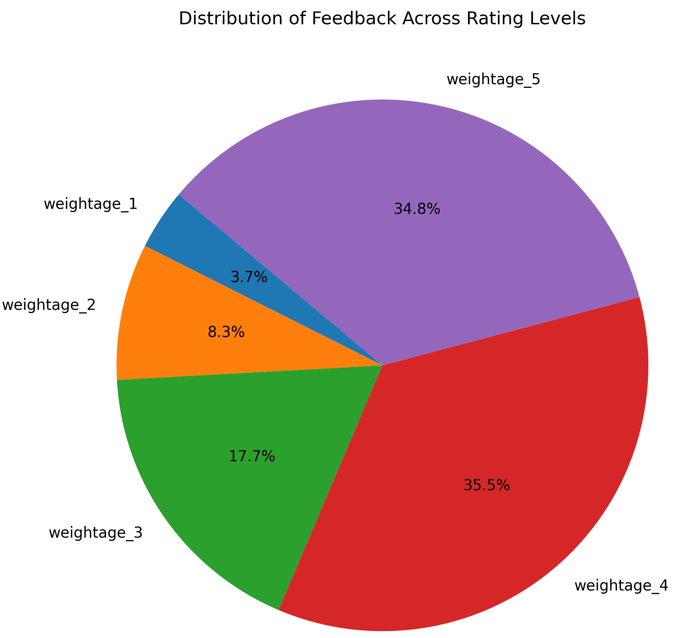

# 🎓 College Event Feedback Analysis


## 📌 Project Overview
This project analyzes student feedback collected during college events to identify strengths, weaknesses, and improvement opportunities. Using **Python** and **Natural Language Processing (NLP)**, we uncover actionable insights to enhance teaching quality, technology adoption, and student engagement.

The project was completed as part of the **Future Interns Data Science & Analytics Internship – Task 3**.

---

## 🎯 Objectives
- Analyze student responses to structured feedback questions.
- Apply **sentiment analysis** (TextBlob & VADER) to open-ended comments.
- Identify top-performing and underperforming areas.
- Provide clear, data-driven recommendations for improvement.
- Present results in a **professional, portfolio-ready format**.

---

## 📂 Dataset
- **Source:** Kaggle.
- **Format:** CSV file with structured and unstructured feedback columns.
- **Size:** ~ 580 rows × 12 columns.
- **Features:**
  - SN :	Serial Number of the Survey Question
  - Total Feedback : Given	Selected number of sample students for the feedback per Course
  - Total Configured :	Total Strength of the batch of the Course
  - Questions :	List of 20 Survey Questions in Total
  - Weightage 1 :	Lowest grade on scale
  - Weightage 2 :	better than lowest but below average rating
  - Weightage 3	: Average
  - Weightage 4	: Above Average
  - Weightage 5	: Best rating
  - Average/ Percentage	: Weighted Average shown in absolute as well as in percentage terms
  - Course Name	: Current Year of the Graduation/Post Graduation
  - Basic Course	: Graduation/Post Graduation Stream
 

---

## 🛠 Tools & Libraries
- **Python** (Data Analysis & NLP)
- **Pandas** – Data cleaning & manipulation
- **NumPy** – Numerical processing
- **Matplotlib / Seaborn** – Data visualization

---

## 📊 Key Insights

**Top 3 Strengths**
1. ✅ Teachers communicate effectively.
2. ✅ Fair internal evaluation process.
3. ✅ Teachers clearly explain expected competencies and outcomes.

**Top 3 Areas for Improvement**
1. ⚠️ Limited use of ICT tools in teaching.
2. ⚠️ Insufficient support for struggling students.
3. ⚠️ Few internship/field visit opportunities.

---

## 📈 Project Workflow
1. **Data Cleaning**
   - Handled missing values.
   - Standardized column names.
   - Removed outliers in rating scores.

2. **Exploratory Data Analysis (EDA)**
   - Descriptive statistics for each question.
   - Visualizing distributions and correlations.

3. **Visualization**
   - Bar charts for average ratings.
   - Word clouds for frequent positive/negative terms.
     
4. **Insights & Recommendations**
   - Strengths to maintain.
   - Weaknesses with actionable suggestions.

---
## Key Visuals

### Rating distribution


### Top & bottom rated questions


### Average Rating Score by Course


### Feedback Distribution


---

## 🏆 Recommendations
- **Boost Use of Educational Technology**: encourage teachers to integrate tools like projectors, online quizzes, or LMS platforms to make learning more engaging.
- **Enhance Mentorship Support**: introduce office hours or peer support programs to help students work on their weaknesses.
- **Increase ICT integration**: Use projectors, multimedia, and e-learning platforms.
- **Personalized student support**: Identify struggling students early and provide mentorship.
- **Expand practical exposure**: Organize internships, field visits, and exchange programs.

---

## 🚀 How to Run the Project
1. **Clone the Repository**
   ```bash
   git clone https://github.com/aanjolaoluwa/FUTURE_DS_03.git
   cd college-event-feedback-analysis

2. **Install Dependencies**
   pip install -r requirements.txt

3. **Open the Notebook**
   jupyter notebook college _event_feedback_analysis(Task 3).ipynb

---
📄 License

This project is licensed under the MIT License – feel free to use, modify, and share.
---
👤 Author

Anjolaoluwa Adekomi

📧 Email: [aadekomi.2201826@stu.cu.edu.ng]

💼 LinkedIn: [https://linkedin.com/in/anjolaoluwa-adekomi-7b2548343/]

📂 Portfolio: [https://anjolaoluwadekomiportfolio.my.canva.site/]


